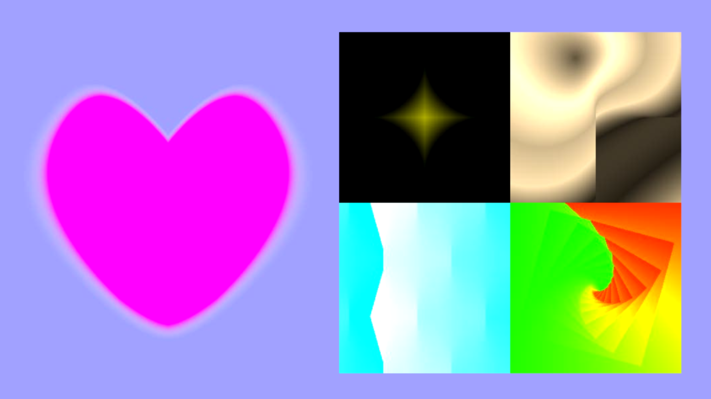

# Quadratic Bézier Custom Shader Node with Demo Project for Godot

This project provides the custom shader node which enables CanvasItem (2D) shader to draw quadratic Bézier curves. 

The custom shader node is also available on [GodotXC](https://godotxc.com).

Please refer to [note](./note/qbezier_shader_note.md) for the mathematical details.

Compatible version: v4.x

---

Project files

 - note/
     - [qbezier_shader_note.md](./note/qbezier_shader_note.md)
 - proj/
     - demo/
         - [demo.tscn](./proj/demo/demo.tscn)
         - [demo_heart.tres](./proj/demo/demo_heart.tres)
         - [demo_motion.tres](./proj/demo/demo_motion.tres)
         - [demo_spiral.tres](./proj/demo/demo_spiral.tres)
         - [demo_stardust.tres](./proj/demo/demo_stardust.tres)
         - [demo_wave.tres](./proj/demo/demo_wave.tres)
     - performance_test/
         - shader/
             - [leaf.gdshader](./proj/performance_test/shader/leaf.gdshader)
             - [leaf.gdshaderinc](./proj/performance_test/shader/leaf.gdshaderinc)
             - [leafs_bg.gdshader](./proj/performance_test/shader/leafs_bg.gdshader)
         - [fps_label.gd](./proj/performance_test/fps_label.gd)
         - [leaf_test.tscn](./proj/performance_test/leaf_test.tscn)
         - [performance.tscn](./proj/performance_test/performance.tscn)
     - shader/
         - bool_utils/
             - [boolean_and_2in_shader_node.gd](./proj/shader/bool_utils/boolean_and_2in_shader_node.gd)
             - [boolean_and_3in_shader_node.gd](./proj/shader/bool_utils/boolean_and_3in_shader_node.gd)
             - [boolean_invert_shader_node.gd](./proj/shader/bool_utils/boolean_invert_shader_node.gd)
             - [boolean_or_2in_shader_node.gd](./proj/shader/bool_utils/boolean_or_2in_shader_node.gd)
             - [boolean_or_3in_shader_node.gd](./proj/shader/bool_utils/boolean_or_3in_shader_node.gd)
             - [within_abs_shader_node.gd](./proj/shader/bool_utils/within_abs_shader_node.gd)
             - [within_range_shader_node.gd](./proj/shader/bool_utils/within_range_shader_node.gd)
         - quad_bezier_utils/
             - [solutions_to_cases_shader_node.gd](./proj/shader/quad_bezier_utils/solutions_to_cases_shader_node.gd)
             - [vector_to_angle_shader_node.gd](./proj/shader/quad_bezier_utils/vector_to_angle_shader_node.gd)
         - uv_utils/
             - [flipped_quad_uv_shader_node.gd](./proj/shader/uv_utils/flipped_quad_uv_shader_node.gd)
             - [mask_float_shader_node.gd](./proj/shader/uv_utils/mask_float_shader_node.gd)
             - [mask_vec2_shader_node.gd](./proj/shader/uv_utils/mask_vec2_shader_node.gd)
             - [mask_vec3_shader_node.gd](./proj/shader/uv_utils/mask_vec3_shader_node.gd)
             - [mirror_uv_shader_node.gd](./proj/shader/uv_utils/mirror_uv_shader_node.gd)
             - [playground.tres](./proj/shader/uv_utils/playground.tres)
             - [spiral_uv_shader_node.gd](./proj/shader/uv_utils/spiral_uv_shader_node.gd)
             - [transform_uv_shader_node.gd](./proj/shader/uv_utils/transform_uv_shader_node.gd)
             - [waved_uv_shader_node.gd](./proj/shader/uv_utils/waved_uv_shader_node.gd)
         - [convert_to_quad_bezier_coord_shader_node.gd](./proj/shader/convert_to_quad_bezier_coord_shader_node.gd)
         - [debug_convert_to_quad_bezier_coord_shader_node.gd](./proj/shader/debug_convert_to_quad_bezier_coord_shader_node.gd)
         - [in_quad_bezier_segment.gd](./proj/shader/in_quad_bezier_segment.gd)
         - [quad_bezier_solver.gdshaderinc](./proj/shader/quad_bezier_solver.gdshaderinc)
     - test/
         - [control_point.gd](./proj/test/control_point.gd)
         - [position_label.gd](./proj/test/position_label.gd)
         - [test.tres](./proj/test/test.tres)
         - [test.tscn](./proj/test/test.tscn)
         - [test_canvas.gd](./proj/test/test_canvas.gd)
     - [icon.svg](./proj/icon.svg)
     - [icon.svg.import](./proj/icon.svg.import)
     - [project.godot](./proj/project.godot)

