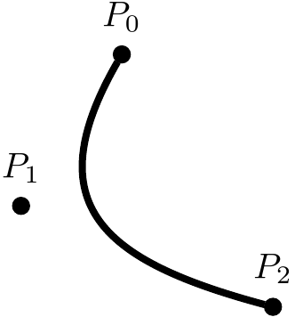

# Quadratic Bézier Curve Note

This note provides the mathematical basis for understanding [the shader include file](../proj/shader/quad_bezier_solver.gdshaderinc).
 

## Definition

For given three control points ($P_0, P_1\ {\rm and}\ P_2$), a __quadratic Bézier curve__ is defined by

$$B(t) = P_1 + (1-t)^2 (P_0 - P_1) + t^2 (P_2 - P_1) \tag{1}$$

where $t$ is a __location parameter__ within the range $[0, 1]$.

 

## Properties

### Tangent Vector

$$B^{\prime}(t) = - 2(1-t)(P_0 - P_1) + 2t(P_2 - P_1) \tag{2}$$ 
 

### Normal Vector

$$B^{\prime}(t) \cdot \overrightarrow{n}(t) = 0 \tag{3}$$

$\overrightarrow{n}(t)$ is called unit normal vector if $|\overrightarrow{n}(t)| = 1$.
 

### Curve Length

A length element of the curve $B(t)$ is $$|B^{\prime}(t)|dt = \sqrt{B^{\prime}(t) \cdot B^{\prime}(t)}dt.$$

Therefore, the __curve length__ from 0 to $s$ is

$$L(s) = \int_0^s {|B^{\prime}(t)|dt} = 2\int_0^s \sqrt{a t^2 + b (1-t)^2 - 2 c t(1-t)}dt$$

$$= 2\int_0^s \sqrt{A t^2 + B t + C}dt\tag{4}$$

where $A = a + b + 2c$, $B = -2b - 2c$, and $C = b$.
 

## Quadratic Bézier Curve Coordinate

Let $P$ is a point in UV coordinate, the __Quadratic Bézier Curve coordinate__ is defined as 

$$(\mathrm{Location\ parameter},\ \mathrm{Minimum\ Displacement}) \equiv (t, x) \in \mathbb{R}^2.$$
 

Since 

$$(P - B(t)) \cdot B^{\prime}(t) = 0 \tag{5}$$

is the required condition for the displacement between $B(t)$ and $P$ is minimal in absolute value, the mapped coordinate can be obtained by solving Equation (5) for $t$ and finding the __minimum displacement__ $x$.
 

Substituting Equation (1) into Equation (5), we get  

$$P_1 \cdot B^{\prime}(t) + (1-t)^2 (P_0 - P_1) \cdot \left(-2(1-t)(P_0 - P_1) + 2t(P_2 - P_1)\right) + t^2 (P_2 - P_1) \cdot \left(-2(1-t)(P_0 - P_1) + 2t(P_2 - P_1)\right)$$

$$= P_1 \cdot B^{\prime}(t) - 2(1-t)^3 \left|P_0 - P_1\right|^2 + 2t(1-t)^2 (P_0 - P_1) \cdot (P_2 - P_1) - 2t^2(1-t) (P_0 - P_1) \cdot (P_2 - P_1) + 2t^3 \left|P_2 - P_1\right|^2$$

$$= P_1 \cdot B^{\prime}(t) - 2(1-t)^3 \left|P_1 - P_0\right|^2 + 2t^3 \left|P_2 - P_1\right|^2 +  2t(1-t)(1-2t) (P_0 - P_1) \cdot (P_2 - P_1) = P \cdot B^{\prime}(t).$$

Organizing the equation for $t$ and also substituting Equation (2), we obtain a cubic equation as  

$$a t^3 - b (1-t)^3 + ct(1-t)(1-2t) + d(1-t) - et = 0$$
where
$a = \left|P_2 - P_1\right|^2,\ b=\left|P_0 - P_1\right|^2,\ c=(P_0 - P_1) \cdot (P_2 - P_1),\ d=(P - P_1) \cdot (P_0 - P_1),\ e=(P - P_1) \cdot (P_2 - P_1).$

Simplify the coefficients, the cubic equation for coordinate mapping to be solved is given by

$$A t^3 + Bt^2 + Ct + D = 0\tag{6}$$

where $A = a+b+2c,\ B=-3b-3c,\ C=3b+c-d-e,\ D=-b+d.$

